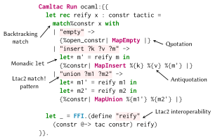

# Camltac: OCaml as a Tactic Language

Camltac allows OCaml to be written directly with Rocq scripts. It supports most constructs from Ltac2, including term construction (`constr:(…)`), pattern matching, and antiquotations using [`ppx_rocq`](https://github.com/epfl-systemf/ppx_rocq), and more. Moreover, Camltac ships with most of the [Ltac2 API](https://rocq-prover.org/doc/master/corelib/index.html#Ltac2), which guarantee stability across Rocq versions.

<center>
  
</center>

See the [quickstart](#quickstart) section for quick examples, or head over to the [tour](./examples/Tour.v) or the [`examples`](./examples/) directory for more complete examples of using Camltac.

## Setup

Install Camltac through `opam` by using the following commands:
```sh
opam update
opam repo add rocq-released https://rocq-prover.github.io/opam/released/
opam pin add https://github.com/epfl-systemf/camltac.git
```

Then, add `From Camltac Require Import Camltac.` to the top of your Rocq files, and you're ready to go!

## Quickstart

### Running OCaml code

The most primitive command provided by Camltac is `Camltac Run`, which runs an arbitrary OCaml snippet between parentheses or brackets:
```coq
From Camltac Require Import Camltac.

Camltac Run ocaml:{{ Feedback.msg_info (Pp.str "Hello world!") }}.
(* Hello world! *)
```

Camltac also allows to define new modules, which can be used to reuse definitions:
```coq
Camltac Module M := ocaml:(let one = 1).

Camltac Run ocaml:{{
  Feedback.msg_info (Pp.int (M.one + M.one))
}}.
(* 2 *)
```

### Creating new tactics

To expose new tactics to Ltac2, use the `Ltac2.FFI` module:
```coq
From Ltac2 Require Import Ltac2.

Camltac Run ocaml:{{
  let say_hello () =
    Feedback.msg_info (Pp.str "Hello from OCaml!")

  let _ = Ltac2.FFI.(define "say_hello" (unit @-> ret unit) say_hello)
}}.

Ltac2 @external say_hello : unit -> unit := "camltac.plugin.runtime" "say_hello".

Ltac2 Eval say_hello (). (* Hello from OCaml! *)
```

Camltac can also run in tactic-in-term mode, similarly to `ltac:(…)` and `ltac2:(…)`:
```
Definition zero := ocaml:(let* z = {%constr| 0 |} in exact_no_check z).
Print zero.
(* zero = 0 : nat *)
```
