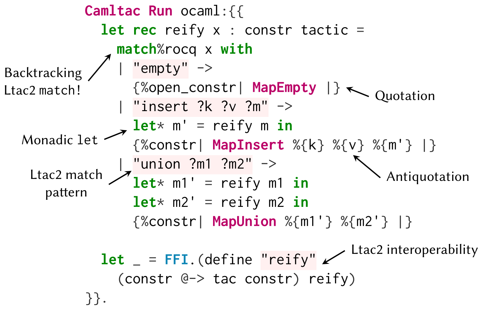

# Camltac: OCaml as a Tactic Language

Camltac is an OCaml plugin for Rocq that allows OCaml code within Rocq scripts. Camltac lets you define OCaml meta-programs and tactics, and run them in the current Rocq state without the friction and boilerplate of setting up a plugin.

<center>
  
</center>

Camltac is both a tactic and a meta-programming language:

1. As a tactic language, Camltac supports most constructs from Ltac2, including term quotations (`{%constr| … |}`), pattern matching (`match%rocq`), and antiquotations using [`ppx_rocq`](https://github.com/epfl-systemf/ppx_rocq). Camltac makes it easy to define new tactics by providing the usual Ltac2 tacticals, and a dedicated <abbr>FFI</abbr> with [Ltac](src/api/ltac.ml) and [Ltac2](src/api/ltac2.ml).
2. As a meta-programming language, Camltac offers a complete meta-programming experience by allowing access to Rocq's internal APIs and state. To ensure stability, Camltac includes the [Ltac2 APIs](https://github.com/epfl-systemf/mltac2) which provide a simple entry point to meta-programming in OCaml.

Have a look at the [tour of Camltac](./examples/Tour.v) for an overview of Camltac's features, or the [quickstart section](#quickstart) for small examples.

## Learning resources

- The [tour of Camltac](./examples/Tour.v) will walk you through Camltac's features and commands through a series of small examples.
- The [quickstart](#quickstart) section contains quick examples that you can immediately run.
- The [`examples`](./examples/) directory has more self-contained examples of using Camltac.

## Setup

Install Camltac through `opam` by using the following commands:
```sh
opam update
opam repo add rocq-released https://rocq-prover.github.io/opam/released/
opam pin add https://github.com/epfl-systemf/camltac.git
```

**Note**: `camltac-examples` only supports Rocq 9.2 and requires OCaml 5.4.

Then, add `From Camltac Require Import Camltac.` to the top of your Rocq files, and you're ready to go!

## Quickstart

### Running OCaml code

The most primitive command provided by Camltac is `Camltac Run`, which runs an arbitrary OCaml snippet between parentheses or brackets:
```coq
From Camltac Require Import Camltac.

Camltac Run ocaml:{{ Feedback.msg_info (Pp.str "Hello world!") }}.
(* Hello world! *)
```

Camltac also allows to define new modules, which can be used to reuse definitions:
```coq
Camltac Module M := ocaml:(let one = 1).

Camltac Run ocaml:{{
  Feedback.msg_info (Pp.int (M.one + M.one))
}}.
(* 2 *)
```

### Creating new tactics

Tactics in Camltac are OCaml values of type `t tactic` for some type `t`. For example, here's a simple tactic that prints the conclusion of the goal:
```coq
Camltac Module Print_conclusion := ocaml:{{
  let run () =
    let open Ltac2 in
    let* goal = Control.goal in
    Message.print (Message.of_constr goal);
    return ()
}}.
```

To evaluate the tactic, use the `ocaml:(…)` quotation in any Ltac or Ltac2 expression:
```coq
Goal forall x : nat, x = x.
Proof.
  ocaml:(Print_conclusion.run ()).
  (* forall x : nat, x = x *)
```

You can also expose it to Ltac2 through the `Ltac2.FFI` module:
```coq
From Ltac2 Require Import Ltac2.

Camltac Run ocaml:{{
  Ltac2.FFI.(define "print_conclusion" (unit @-> tac unit) Print_conclusion.run)
}}.

Ltac2 @external print_conclusion : unit -> unit := "camltac.plugin.runtime" "print_conclusion".

Goal forall x : nat, x = x.
Proof.
  print_conclusion ().
  (* forall x : nat, x = x *)
```

Finally, Camltac can also run in tactic-in-term mode, similarly to `ltac:(…)` and `ltac2:(…)`:
```
Definition zero := ocaml:(let* z = {%constr| 0 |} in exact_no_check z).
Print zero.
(* zero = 0 : nat *)
```
